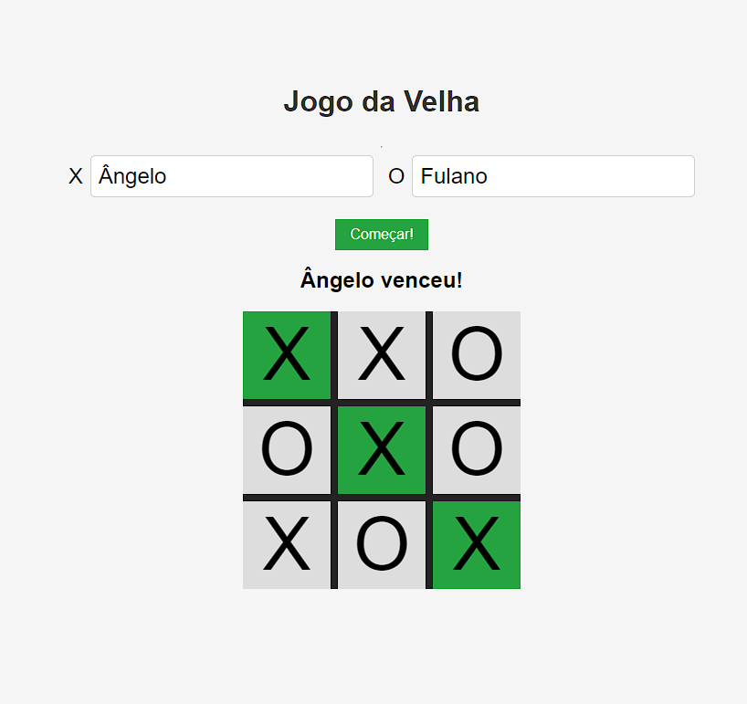

# Jogo da Velha

## Descrição
O Jogo da Velha é uma implementação simples e divertida do clássico jogo da velha para jogar no navegador. Este projeto foi desenvolvido como parte do meu aprendizado em desenvolvimento web.

## Funcionalidades Principais
- Interface intuitiva e fácil de usar.
- Possibilidade de jogar contra outro jogador.
- Design responsivo para se adaptar a diferentes dispositivos.

## Tecnologias Utilizadas
- HTML5
- CSS3
- JavaScript
- Git (para controle de versão)

## Como Utilizar
1. Clone o repositório (`git clone https://github.com/seu-usuario/jogo-da-velha.git`).
2. Abra o arquivo `index.html` em seu navegador web.
3. Insira os nomes dos jogadores nos campos de entrada.
4. Clique no botão "Começar!" para iniciar o jogo.
5. Clique em uma célula vazia do tabuleiro para fazer sua jogada.
6. O primeiro jogador a conseguir três símbolos iguais em linha, coluna ou diagonal vence.
7. Divirta-se jogando!

## Autor
Angelo Hervis
- GitHub: [AngeloHervis](https://github.com/AngeloHervis)
- LinkedIn: [Angelo Hervis](https://www.linkedin.com/in/angelo-hervis/))
